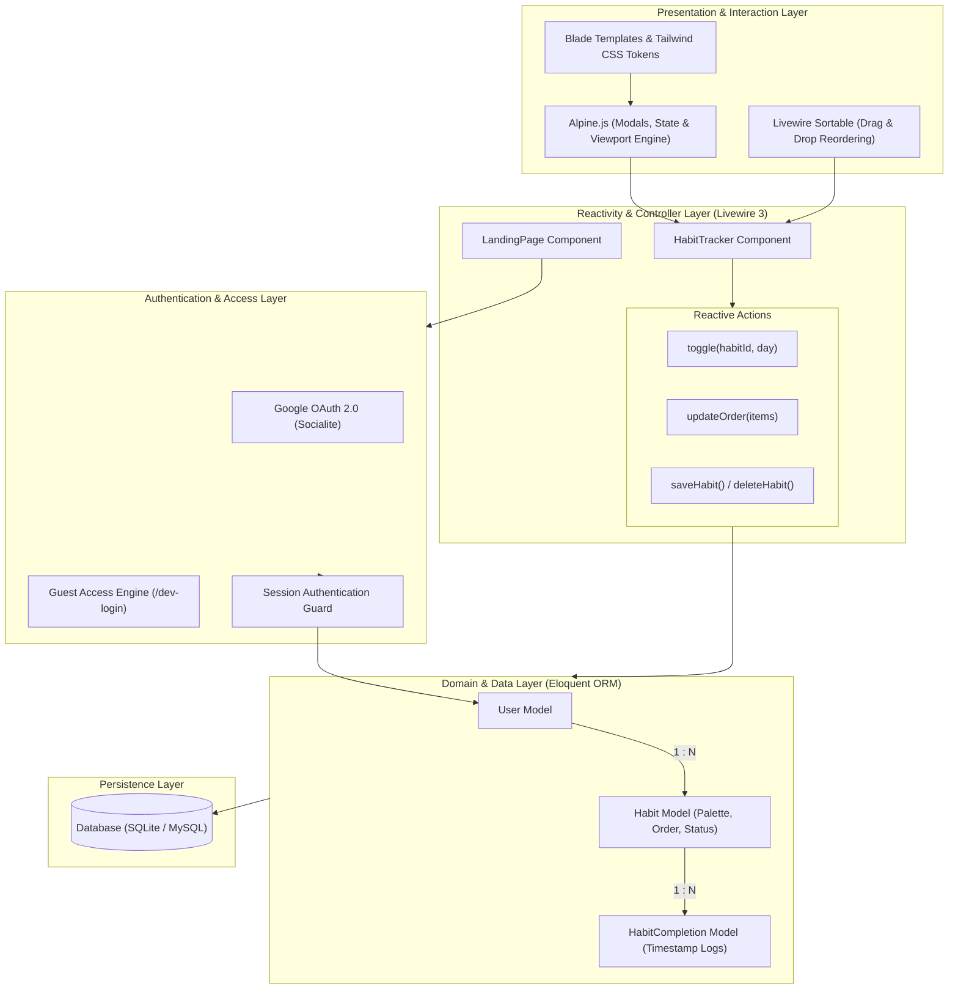

# ✦ Cadence — Minimalist Habit Engine & Consistency Architecture

Cadence is a high-velocity habit tracking engine and consistency architecture built with **Laravel**, **Livewire 3**, **Alpine.js**, and **Tailwind CSS**. It combines real-time reactive scheduling with a tactile editorial design system to help individuals build discipline like a system.


---

## 🏛 System Architecture & Visual Design

The Cadence platform is engineered as a reactive, offline-first application model leveraging full-stack component re-rendering and client-side micro-interactions.

### High-Level Architecture Flow



---

### Component & Data Architecture

```text
┌────────────────────────────────────────────────────────────────────────┐
│                        CADENCE CLIENT RUNTIME                          │
│                                                                        │
│   ┌───────────────────────────┐         ┌──────────────────────────┐   │
│   │   Editorial Layout        │         │   Tactile Interactions   │   │
│   │  (Cormorant Garamond      │ ──────▶ │   - Paint-seal animations│   │
│   │   + Inter Sans Serif)     │         │   - Auto-scroll to today │   │
│   │   - Cream Canvas (#FAF9F5)│         │   - Alpine.js Modals     │   │
│   └───────────────────────────┘         └──────────────────────────┘   │
└────────────────────────────────────┬───────────────────────────────────┘
                                     │ Livewire DOM Morphing
                                     ▼
┌────────────────────────────────────────────────────────────────────────┐
│                   FULL-STACK REACTIVE CONTROLLERS                      │
│                                                                        │
│   ┌────────────────────────────────┐  ┌────────────────────────────┐   │
│   │     LandingPage (Livewire)     │  │   HabitTracker (Livewire)  │   │
│   │  - Hero & Atelier Showcase     │  │  - 31-Day Calendar Matrix  │   │
│   │  - Contextual Navigation       │  │  - Artist Palette Picker   │   │
│   │  - Feature Demonstrations      │  │  - Sortable Drag-and-Drop  │   │
│   └────────────────────────────────┘  └────────────────────────────┘   │
└────────────────────────────────────┬───────────────────────────────────┘
                                     │ Eloquent Transactions
                                     ▼
┌────────────────────────────────────────────────────────────────────────┐
│                      DATA & PERSISTENCE DOMAIN                         │
│                                                                        │
│   ┌──────────────┐         ┌───────────────┐        ┌──────────────┐   │
│   │    Users     │ 1 ────* │    Habits     │ 1 ───* │ Completions  │   │
│   │ (Auth/Guest) │         │ (Palette/Sort)│        │ (Daily Log)  │   │
│   └──────────────┘         └───────────────┘        └──────────────┘   │
└────────────────────────────────────────────────────────────────────────┘
```

---

## 🎨 Visual Design System

Cadence features a distinct, custom-crafted visual language built directly into Tailwind CSS:

- **Canvas Foundation (`#faf9f5`)**: Warm, cream-tinted canvas eliminating harsh digital glare.
- **Surface Elevation (`#efe9de`)**: Layered, tactile card structures with clean hairlines (`#e6dfd8`).
- **Signature Coral (`#cc785c`)**: Vibrant, high-contrast focal accent for critical actions.
- **Editorial Typography**: 
  - **Headlines:** Cormorant Garamond display serif with subtle negative tracking.
  - **Body / Interface:** Inter for clean, legible data presentation.
  - **Metrics & Code:** JetBrains Mono for precision data logs.
- **Paint-Seal Completion Marks**: Tactile scale animations that visually stamp completed streaks like wax seals.

---

## ✨ Core Features

| Feature | Description |
|---|---|
| **Daily Cadence Matrix** | High-density monthly calendar grid with horizontal viewport panning and auto-centering on the current day. |
| **Streak Masterpieces** | Visual momentum indicators where consistency layers over time like an artist canvas. |
| **Artisan Color Palettes** | 12 curated habit pigments including Ultramarine, Prussian Blue, Burnt Umber, Venetian Ochre, Vermilion, and Coral. |
| **Livewire Drag-and-Drop** | Reorder daily habit hierarchy on the fly using `livewire-sortable`. |
| **Instant Guest Access** | Seamless local evaluation and zero-friction onboarding via `/dev-login`. |
| **Google OAuth Integration** | Full cloud account synchronization via Laravel Socialite. |

---

## 🗂 Directory Structure

```text
habit-tracker/
├── app/
│   ├── Http/Controllers/     # Authentication & OAuth controllers
│   ├── Livewire/             # Reactive full-stack Livewire components
│   └── Models/               # Eloquent domain models (User, Habit, Completion)
├── database/
│   └── migrations/           # Database schema migrations
├── public/
│   └── images/               # High-resolution architectural assets
├── resources/
│   ├── css/                  # App styles, custom animations & design tokens
│   ├── js/                   # Vite entrypoint & Livewire sortable runtime
│   └── views/                # Blade layouts & Livewire templates
├── routes/
│   └── web.php               # Application routing & guest access points
├── DESIGN_SYSTEM.md          # Full design token & UI component specifications
├── tailwind.config.js        # Custom palette, typography, and animation tokens
└── vite.config.js            # Asset bundling configuration
```

---

## 🚀 Quick Start & Installation

### Prerequisites
- **PHP** >= 8.1
- **Composer** >= 2.0
- **Node.js** >= 18.0 & **npm**
- **SQLite** or **MySQL**

### 1. Clone & Install Dependencies
```bash
git clone https://github.com/Chirag-Pareek/Cadence.git
cd Cadence

composer install
npm install
```

### 2. Environment Configuration
```bash
cp .env.example .env
php artisan key:generate
```

### 3. Database Migration
```bash
php artisan migrate
```

### 4. Run Development Servers
```bash
# Terminal 1: Vite Hot Module Reloading
npm run dev

# Terminal 2: Laravel Server
php artisan serve
```

Navigate to `http://localhost:8000` to launch Cadence.

> **Instant Access**: Click **"Start Your Cadence"** or navigate directly to `/dev-login` for instant guest access without needing OAuth credentials.

---

## 🛠 Tech Stack

- **Backend Framework:** Laravel 10
- **Reactivity Engine:** Laravel Livewire 3
- **Client Interactions:** Alpine.js
- **Styling Architecture:** Tailwind CSS v3 with Forms & Typography plugins
- **Asset Bundler:** Vite 5
- **Iconography:** FontAwesome 6

---

## 📄 License

The Cadence Habit Engine is open-source software licensed under the [MIT license](LICENSE).
